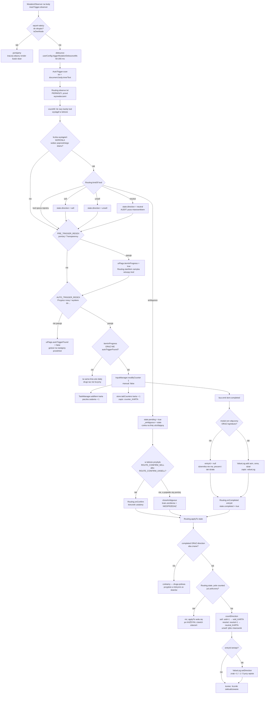
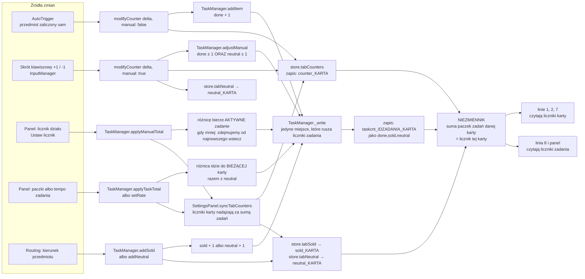
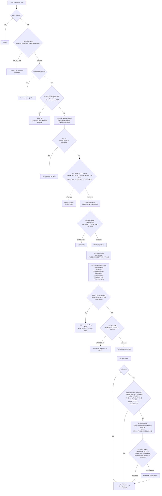
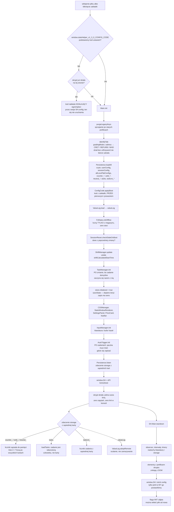

# Przepływy: co się dzieje i w jakiej kolejności

Cztery diagramy dla kogoś, kto ma w tym kodzie **znaleźć błąd albo zaproponować
zmianę**. Każdy odpowiada na jedno pytanie i kończy się dwoma rozdziałami, które
są tu ważniejsze niż sam obrazek: **gdzie to się psuje** (z nazwami usterek,
które już się zdarzyły) i **co tego pilnuje** (pliki testów).

| Diagram                                                | Pytanie                                                                        |
| ------------------------------------------------------ | ------------------------------------------------------------------------------ |
| [1. Życie przedmiotu](#1-życie-przedmiotu)             | od mutacji DOM do wpisu w dzienniku — gdzie przedmiot może się zgubić          |
| [2. Kto pisze do liczników](#2-kto-pisze-do-liczników) | pięć źródeł zmian i jeden niezmiennik, który je spina                          |
| [3. Droga do sieci](#3-droga-do-sieci)                 | wszystkie bramki między „chcę cenę” a `fetch`                                  |
| [4. Uruchomienie i magazyn](#4-uruchomienie-i-magazyn) | dlaczego `Main.init()` ma dokładnie taką kolejność i kto pisze do localStorage |

**Zasada utrzymania:** diagram, który kłamie, jest gorszy niż jego brak. Jeśli
zmiana w kodzie rozjeżdża się z obrazkiem, poprawia się jedno albo drugie —
w tym samym PR. Pilnuje tego `tests/25-flow-docs.test.js`: sprawdza, że każdy
moduł, każda stała konfiguracji i każda funkcja wymieniona w tym pliku naprawdę
istnieje w artefakcie.

Diagramy są w Mermaid, więc GitHub rysuje je sam, bez żadnego zewnętrznego
serwisu — a w diffie widać, co dokładnie się zmieniło.

---

## 1. Życie przedmiotu

Od zmiany tekstu na stronie T-REX do wpisu w dzienniku wartości. Jedna klatka
skanu, dwie niezależne połowy stanu: **zaliczenie** i **kierunek**.

### Co tu widać

**Kolejność w `scan()` jest częścią mechanizmu.** `Routing.observe()` idzie
**przed** sprawdzeniem wyzwalaczy, żeby w klatce, w której kod sortowania
pojawia się razem z `Przypisz nowy`, kierunek był już znany w chwili tworzenia
wpisu w dzienniku. Odwrotna kolejność nie psuje liczb — znak dopisałby się
następnym skanem — ale robi z prostego przypadku ścieżkę wsteczną.

**Dwie połowy stanu są niezależne.** Kod sortowania potrafi pojawić się przed
wyzwalaczem końcowym, razem z nim albo po nim. Dlatego `applyTo()` woła się po
**każdym** z dwóch zdarzeń i sprawdza oba warunki, a znacznik `counted` pilnuje,
żeby przedmiot nie policzył się dwa razy.

**Liczy się WZROST liczby wystąpień, a nie sama obecność kodu.** Na ekranie jest
dziennik, w którym kod wisi dalej po tym, jak zadziałał. Zwykłe „czy kod jest
w tekście” doczepiałoby stary kod do następnego przedmiotu; licznik wystąpień
przeżywa też dwa jednakowe kody pod rząd.

**Brak kodu to nie to samo, co audyt.** Przedmiot bez kodu zostaje
w mianowniku procentu (znaczy „nie zobaczyliśmy”), audyt z mianownika wypada
(znaczy „nie da się wiedzieć”).

### Gdzie to się psuje

| Pułapka                                     | Objaw                                                                                                                |
| ------------------------------------------- | -------------------------------------------------------------------------------------------------------------------- |
| własne węzły w obserwatorze                 | okno statystyk przerysowuje się co sekundę, każdy render budzi `scan()` z odczytem `innerText` — najdroższa operacja |
| `autoTriggerFound` bez zerowania            | linia wyzwalacza wisi na ekranie i liczy się w każdym skanie                                                         |
| kierunek liczony w momencie zakończenia     | kody, które przyszły po wyzwalaczu, przepadają                                                                       |
| `Routing.onCompleted` wołane tylko z wpisem | przy wyłączonym module cen procent stoi na zerze całą zmianę (usterka sprzed 1.1.0)                                  |
| kod z ogonem (`External-Repair`)            | wzorzec zaczepia się o POCZĄTEK kodu; dokładne dopasowanie gubiłoby całe rodziny                                     |

### Co tego pilnuje

`tests/08-parsers.test.js` (wyzwalacze i liczenie wystąpień),
`tests/17-sales-rate.test.js` (procent przy wyłączonym module cen),
`tests/21-route-codes.test.js` (rodziny kodów, przedrostek `NS-`, audyt),
`tests/22-tasks.test.js` (paczka trafia do zadania w tej samej chwili).

---

## 2. Kto pisze do liczników

Pięć źródeł zmian i jedna równość, która musi trzymać zawsze.

### Co tu widać

**Liczniki karty są źródłem prawdy dla linii 1, 2 i 7; zadania są ich rozbiciem
w czasie.** Obie strony ruszają się w jednym miejscu — w metodach menedżera
zadań — i dlatego mogą się nie rozjechać. Rozjazd byłby cichy: obie liczby
wyglądałyby sensownie, tylko nie opisywałyby tego samego.

**Ręcznie wpisana paczka idzie do `done` I do `neutral`.** Kierunku takiego
przedmiotu nikt nie zna, więc nie ma prawa ruszyć procentu ani w górę, ani
w dół. To jest powód, dla którego po awarii maszyny procent liczy się od
przedmiotu, przy którym człowiek wrócił do pracy.

**Zmniejszenie liczby paczek jest przewidywalne.** Przy wpisaniu liczby
mniejszej niż suma zadań nadmiar schodzi **od najnowszego zadania wstecz**, a nie
proporcjonalnie — praca sprzed kilku godzin zostaje nietknięta.

**Zadanie nie jest przypisane do działu.** Trzyma liczniki osobno dla każdego,
bo jeden proces pracy potrafi iść w dwóch kartach naraz. Paczka trafia zawsze do
pary _zadanie + dział_.

### Gdzie to się psuje

| Pułapka                                                   | Objaw                                                                                    |
| --------------------------------------------------------- | ---------------------------------------------------------------------------------------- |
| nowa droga zapisu z pominięciem `_write`                  | suma zadań rozjeżdża się z licznikiem karty; linia 1 i linia 8 mówią co innego           |
| ręczny wpis bez `neutral`                                 | procent sprzedaży spada do kilku procent po każdym powrocie do pracy                     |
| zapis liczników zadania jednym kluczem na wszystkie karty | dwie karty zamazują sobie liczby nawzajem (dlatego klucz ma w nazwie i zadanie, i kartę) |
| `tabCounters` ustawiane wprost w panelu                   | zadania zostają ze starą liczbą, niezmiennik pada                                        |

### Co tego pilnuje

`tests/22-tasks.test.js` — funkcja `drift()` sprawdza niezmiennik po **każdym**
istotnym scenariuszu; `tests/23-task-panel.test.js` — oba pola panelu;
`tests/24-departments.test.js` — dział ręczny i zmniejszanie liczby paczek.

---

## 3. Droga do sieci

Główna właściwość produktu: po wklejeniu pliku **zero zapytań**. Wszystko poniżej
zaczyna się dopiero po świadomym włączeniu modułu cen.

### Co tu widać

**Bramka modułu cen stoi na trzech poziomach:** na wejściu do `resolve()`,
w pętli po oczekiwaniu na slot i na samym dole, w `PriceNet` — przez niego idzie
każde zapytanie i każdy obrazek modułu cen, także kursy i diagnostyka. To nie
jest nadmiarowość przez przeoczenie — dolna bariera istnieje po to, żeby nowa
ścieżka wywołania, dopisana kiedyś przez kogoś, kto zapomni o sprawdzeniu wyżej,
też nie wypuściła zapytania.

**Limit liczy się osobno dla obrazków i dla zapytań tekstowych** (`kind` źródła).
Wspólny licznik sprawiałby, że obrazkowe źródło zjada limit tekstowy.

**Karta nie wie, skąd jest cena.** Hosty, adresy i rozbiór odpowiedzi żyją
w `src/15-price-sources.js`; karta zna tylko kontrakt źródła (`run`, `kind`,
`available`, `marketSearch`).

**Adres nigdy nie powstaje z danych strony.** Host i schemat są wszyte na stałe,
ASIN przechodzi przez zakotwiczone wyrażenie `^[A-Z0-9]{10}$`, reszta idzie przez
`encodeURIComponent`.

**Dwa zdarzenia, które przychodzą z opóźnieniem:** `securitypolicyviolation`
(stąd flagi `csp.net` i `csp.img` sprawdzane w KAŻDYM obiegu pętli) oraz zmiana
przedmiotu na ekranie (stąd sprawdzenie `shownAsin` w przeglądzie rynków).

Poza tą ścieżką do sieci wychodzą jeszcze dwa miejsca, oba przez `PriceNet`
i oba po świadomym kliknięciu: `FxRates.refresh()` przy włączaniu modułu cen
i `SH.cspReport()` wywołany ręcznie z konsoli.

### Gdzie to się psuje

| Pułapka                             | Objaw                                                                                            |
| ----------------------------------- | ------------------------------------------------------------------------------------------------ |
| sprawdzenie modułu tylko na wejściu | wyłączenie modułu w trakcie zapytania nie zatrzymuje reszty serii                                |
| limit sprawdzany przed pętlą        | jeden typ dostawcy zjada cudzy limit                                                             |
| brak sprawdzenia `shownAsin`        | przegląd rynków dosyła zapytania o przedmiot, którego dawno nie ma na ekranie                    |
| adres sklejany z tekstu strony      | dziura na wstrzyknięcie; dlatego host pochodzi z białej listy, a ASIN z wyrażenia zakotwiczonego |

### Co tego pilnuje

`tests/01-silence.test.js` (zero zapytań po starcie),
`tests/05-price-module.test.js` (bramka modułu na każdym poziomie),
`tests/06-injection.test.js` (adresy i ucieczka znaków),
`tests/09-artifact.test.js` (biała lista hostów w całym pliku),
`tests/14-price-boundaries.test.js` (granice kwot).

---

## 4. Uruchomienie i magazyn

`Main.init()` ma kolejność, która wygląda na dowolną, a dowolna nie jest —
każdy krok czegoś potrzebuje od poprzedniego.

### Co tu widać

**`identifyTab()` przed `loadAll()`.** Ustawienia karty czytają się po kluczu
`currentTabInstanceId`; przy odwrotnej kolejności wygląd okna nie przywracałby się
po `F5`, a do magazynu trafiałby śmieciowy klucz `null`.

**Kod ustawień z zakładki wchodzi przed pierwszym rysowaniem.** Dzięki temu okno
od razu jest takie, jakiego człowiek chce — bez mrugnięcia wyglądem domyślnym.

**`TaskManager.init()` po `ShiftManager.update()`, a przed `AutoTrigger.init()`.**
Po — bo zadanie domyślne zaczyna się razem ze zmianą, a godzina startu liczy się
linijkę wyżej. Przed — bo licznik nie ma prawa zaliczyć paczki, dla której nie ma
gdzie jej zapisać.

**`saveState()` sprawdza `store.initialized`.** Wszystko, co dzieje się wcześniej,
jest odczytem; zapis przed tą flagą zapisałby stan w połowie wczytany.

**Sieci nie ma w tej ścieżce ani jednej.** `FxRates.initOffline()` czyta wyłącznie
magazyn — pobranie kursów na żywo robi dopiero `PriceModule.enable()`.

### Gdzie to się psuje

| Pułapka                                         | Objaw                                                                                            |
| ----------------------------------------------- | ------------------------------------------------------------------------------------------------ |
| zapis przed `initialized`                       | do magazynu trafia stan w połowie wczytany                                                       |
| brak `listen()` albo zły filtr klucza           | dwie karty nie widzą się nawzajem, linia 2 pokazuje tylko swoją                                  |
| `teardown` bez czyszczenia timerów              | zdjęty egzemplarz dalej rysuje i sypie wyjątkami dokładnie wtedy, gdy wkleja się poprawiony plik |
| skrót `config` zdejmowany bezwarunkowo          | rozbiórka zabiera stronie jej własną funkcję o tej samej nazwie                                  |
| czyszczenie całego magazynu zamiast `ownKeys()` | kasowanie danych roboczych samego T-REX                                                          |

### Co tego pilnuje

`tests/01-silence.test.js` (cisza po starcie),
`tests/04-multitab.test.js` (dwie karty na jednym magazynie),
`tests/11-storage-failure.test.js` (pełny albo zepsuty magazyn),
`tests/20-config-code.test.js` (kod z zakładki przed pierwszym rysowaniem),
`tests/22-tasks.test.js` (zadanie domyślne zaczyna się razem ze zmianą).

---

## Jak dopisać diagram

1. Jeden diagram = jedno pytanie. Jeśli nie da się go streścić w jednym zdaniu,
   to są dwa diagramy.
2. Pod każdym: **gdzie to się psuje** i **co tego pilnuje**. Sam obrazek pokazuje
   szczęśliwą ścieżkę, a szukającemu błędu potrzebne są te dwie rzeczy.
3. Nazwy modułów, stałych i funkcji pisz dokładnie tak, jak w kodzie — test
   `tests/25-flow-docs.test.js` sprawdza, że każda z nich istnieje, i zapali się,
   gdy któraś zniknie albo zmieni nazwę.
